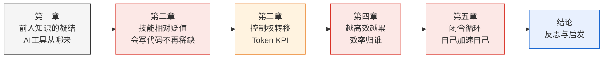

# 效率反噬：AI 编程工具对中国互联网工程师劳动过程的重构

## 摘要

2026 年，中国互联网大厂正在经历一场由 AI 编程工具引发的劳动过程深刻重构。阿里巴巴将核心考核指标从日活用户数更换为 Token 消耗量，腾讯内部公布 Token 消耗排名，小米大模型负责人公开表示"每天 AI 对话少于 100 次的人可以辞职"——这些分散的公司决策背后，隐藏着一个共同的逻辑：当 AI 工具大幅提升了工程师的个体产出效率，效率提升的果实没有转化为闲暇或更高的工资，而是被管理层立即吸收为更高的产出要求。本文以 2026 年中国互联网大厂的 Token KPI 考核体系为核心经验材料，运用马克思劳动过程理论的分析框架，论证一个五环因果链：AI 编程工具作为前人编程知识的集体凝结（第一环），降低了"写出能用的代码"所需的学习投入，导致个体工程师的技能相对贬值（第二环）；技能贬值削弱了劳动者的议价能力，劳动过程的控制权——"怎么干活、用什么工具、产出多少算达标"的决定权——向资本方倾斜（第三环）；控制权在手，AI 的效率提升立即被转化为更高的产出要求，劳动者陷入"越高效越累"的悖论（第四环）；而工程师在考核压力下开发的内部 AI 工具，进一步覆盖自己和他人的技能，形成一个自我加速的闭合循环（第五环）。本文的贡献在于：将去技能化与劳动强化这两个通常被分开论述的机制，联结为一套因果循环，并以 2026 年 Token KPI 这一尚未被学术文献系统分析的新现象为经验锚点，展示马克思劳动过程理论对当代知识密集型行业仍具有强大的解释力。

**关键词**：AI 编程工具；劳动过程；去技能化；Token KPI；相对剩余价值

---

## 论文结构



---

## 引言

2026 年 3 月 16 日，阿里巴巴集团 CEO 吴泳铭亲自挂帅，成立了 ATH（Alibaba Token Hub）事业群。[^1] 这不仅是阿里历史上规模最大的一次 AI 业务整合——通义实验室、MaaS 业务线、千问事业部等五大事业群全部并入，更引人注目的是它的考核逻辑：核心指标从日活用户数（DAU）直接更换为 Token 消耗量。模型效果的评估、用户体验的衡量，全部折算为 Token 调用量。员工的 Token 消耗被做成排行榜，排名直接与绩效评级、转正、晋升挂钩。

[^1]: 本文涉及的国内大厂 Token KPI 管理措施，来源于 2026 年 6 月中国科技媒体的交叉报道，主要来源包括：36氪"多少大厂牛马正在被强迫使用AI？"（2026年6月）、36氪"失控，AI的第一个泡沫，是程序员"（2026年6月）、凤凰网科技"AI写了90%代码，大厂程序员的煎熬时刻"（2026年4月）、南方都市报"叫停Token排名、设定支出上限……巨头开始审视AI账单"（2026年6月8日）。各方报道在关键事实上相互印证，本文以阿里巴巴为头部案例，其余公司为参照。以下不再逐条标注媒体来源。

这不是阿里的孤立行为。2026 年上半年，中国互联网行业出现了一股将 AI Token 消耗量纳入工程师绩效考核的浪潮。腾讯内部公布 Token 消耗排名（后在 6 月初因"焦虑式管理"争议而取消）。小米大模型负责人罗福莉公开表示"团队中每天 AI 对话次数少于 100 次的成员可以辞职"。58 同城董事长姚劲波要求"Token 用得越多越好，不计成本"。网易推行 AI 工具聚合平台，以员工的积分消耗情况判断 AI 使用频率，积分低的被约谈。昆仑万维强制技术序列全员使用 AI 编程工具，开发效率须提高至少 50%，未达标者面临 5% 至 20% 的末位淘汰。

与 Token KPI 同步发生的，是编程岗位体系的结构性消融。传统的前端工程师岗位几乎消失——得物解散了前端开发部门，全体员工转向"AI 全栈"；阿里巴巴取消了专门的后端工程师招聘，所有新岗位统一为"AI 应用研发工程师"。招聘平台上的职位描述不再区分前端和后端，取而代之的是对 LangChain、Dify、RAG（检索增强生成）、Agent 开发等 AI 相关技能的统一要求。与此同时，没有任何一家中国公司公开宣布因 AI 替代而裁员——行动是通过不招新人、不续签合同、"业务调整"等柔性方式进行的。2026 年 6 月 30 日，Shopee、飞猪、美团等多家公司的程序员同期收到裁员通知，部分部门的团队规模被压缩了 25% 至 50%。

在进入理论分析之前，先看一个场景。2026 年 6 月的一个普通工作日，一位在阿里工作了三年的后端工程师早上打开电脑。他不会写一行传统意义上的代码——他打开公司的 AI 编程助手，用自然语言描述需求，三十秒后拿到可运行的代码，然后检查逻辑、调整参数、提交审查。这个循环他重复了一整天。到傍晚，他的 Token 消耗数据自动上传到了部门的 AI 使用看板——排名第八，比上周掉了两名。他犹豫片刻，决定睡前再让 AI 多跑几个任务。不是因为有东西需要做，而是排名不能再掉了。他不是特例。他是 2026 年中国大厂工程师新常态的一个缩影。

这些分散的事件之间是否存在一个统一的分析逻辑？本文尝试用马克思劳动过程理论的框架来回答这个问题。本文的核心论点是：AI 编程工具作为前人编程知识的集体凝结，降低了个体工程师的技能稀缺性（去技能化），从而削弱了劳动者对劳动过程的议价能力；控制权转移后，AI 的效率提升被管理层立即吸收为更高的产出要求——人反而更累了；而工程师在考核压力下开发的内部 AI 工具，正在持续覆盖自己和他人的技能，构成一个自我加速的循环。这个循环的逻辑链条将在下文分五章展开。

在进入分析之前，有必要说明本文与已有研究的关系，并澄清本文的边界。

关于 AI 对劳动过程的影响，已有研究为我们提供了重要的出发点。马克思在《资本论》中对机器和大工业的分析（1867）以及 Braverman 对"去技能化"的系统论证（1974）构成了经典基础。在当代文献中，Steinhoff（2024）提出了机器学习"涌现式吸收"技能的新机制，Zhang（2026）和《学习与实践》（2026）分析了 AI 如何同时强化相对剩余价值和绝对剩余价值的生产，Chauhan（2026）提供了软件工程中去技能化的跨国经验证据，韩文龙等人（2025）从生产力三要素的视角分析了 AI 对劳动过程的四重变革向度，金华等人（2025）提出了知识密集型行业中"知识技能空心化"的本土概念。这些研究分别在去技能化、剩余价值生产、算法管理和劳动过程变革等维度做出了贡献，但它们通常将"技能贬值"和"劳动强化"作为两个独立机制来处理，尚未系统论证两者之间的因果关系。本文试图填补这个缺口：不是分别讨论技能贬值和劳动强化，而是论证前者如何导致了后者，并形成一个自我加速的闭合循环。

本文讨论的是 AI 编程工具对工程师劳动**过程**的影响——即"怎么干活、谁决定怎么干活、效率提升的果实归谁"的问题。本文不直接回答"AI 会不会导致程序员大面积失业"的就业总量问题，也不涉及 AI 芯片、底层编译器或训练框架等基础设施层面的技术分析。本文的经验材料主要来自中国互联网行业，以阿里巴巴为深度案例。选择阿里巴巴，是因为它在本轮 Token KPI 浪潮中动作最大、组织调整最激进——成立了专门的 ATH 事业群、由集团 CEO 亲自挂帅、将核心考核指标从 DAU 直接替换为 Token 消耗量。这些特征使其成为观察 AI 时代劳动过程控制权转移的"极端案例"，适合用于揭示机制，而非代表行业的普遍状况。部分国际案例用作比较参照。

---

## 第一章 前人知识的凝结：AI 编程工具从何而来

在分析 AI 编程工具对工程师的影响之前，必须首先澄清一个经常被忽略的前提：这些工具不是凭空出现的。今天能够自动生成代码的大语言模型——无论是 Anthropic 的 Claude、OpenAI 的 Codex，还是中国本土的通义灵码、DeepSeek Coder——它们的训练数据来自全球程序员在过去几十年中公开发布的海量代码、技术文档、问答讨论和学术论文。Stack Overflow 上数以百万计的问答、GitHub 上数以亿计的代码提交、各大学术会议上发表的算法论文——这些是人类程序员集体智力劳动的产物。AI 编程工具的"能力"，本质上是这些前人劳动成果被模型"吸收"后的重新释放。

马克思在《资本论》第一卷中分析机器的本质时，提出了一个对于理解 AI 至关重要的观点：机器并非自然界现成的东西，而是人类过去劳动的对象化。工人用时间和技能制造出机器，机器凝结了这些劳动。但在资本主义生产关系下，这些对象化的劳动成果不属于制造它的工人，而是被资本占用，并反过来被用于规定活着的工人如何劳动。马克思将机器称为"不变资本"——不变，是因为它只能转移自身的价值到产品中，不能创造超过自身价值的新价值；只有活人的劳动（"可变资本"）才能创造新价值。但这个概念同时也揭示了另一层关系：前人劳动一旦被凝结为机器，就不再受前人的控制，而成为支配后人的力量。

Braverman（1974）在《劳动与垄断资本》中把马克思的这个框架发展成了一套系统的"去技能化"命题。他的核心洞察是：在资本主义劳动过程中，存在着一种将"概念"与"执行"分离的系统趋势——前者集中于管理层，后者分配给被去技能化的工人。这个趋势的动力不是管理者的"恶意"，而是资本控制劳动过程的结构性需要：只要工人还掌握着不可替代的技能知识，他们就保留了议价权；把技能从工人身上抽走并嵌入到机器和管理流程中，就等于剥夺了这种议价权。Foster（2024）在 Braverman 著作五十周年的回顾文章中论证，这个分析框架对于理解 AI 时代的劳动过程仍然有效——甚至更加有效，因为 AI 吸收技能的规模和速度远超历史上的任何技术。

Steinhoff（2024）在《Work in the Global Economy》上对 Marx→Braverman 的框架做了一次重要的当代化推进。他提出，去技能化（deskilling）不仅是把技能从工人身上抽走，更是把这些技能**实现在机器之中**——他称这个过程为"吸收"。在马克思的时代，吸收需要"编码"：你必须能把一种技能翻译成明确的规则，才能嵌入机器（就像泰勒制把工人的操作分解为标准动作）。但 2015 年之后的机器学习改变了这一点。模型不需要任何人把"怎么写代码"翻译成规则——它从海量示例中自行提取模式和规律。Steinhoff 称之为"涌现式吸收"：吸收不再依赖知识编码，能力的获取范围因此大大扩展。

AI 编程工具正是"涌现式吸收"的典型案例。它们不需要任何人写出"生成一个排序函数的规则"——它们从数以百万计的排序函数实现中，自己学到了什么是一个合理的排序函数。它们不需要被教授"如何在 Python 中连接数据库"——它们读过了足够多的数据库连接代码，可以直接生成可行的实现。

这一机制的覆盖范围不限于简单的业务逻辑。在 2026 年的技术实践中，AI 代码生成已经从最初的应用层（写一个网页、拼接一个 API）向上扩展到了基础设施层。曾经需要具备多年系统编程经验的 CUDA 算子编写、分布式训练脚本配置、编译器优化等工作，AI 工具正在逐步覆盖。不同层级的编程活动——从业务代码到底层优化——对应着工程师在不同学习阶段积累的不同类型的知识，而现在 AI 在每一层都能生成至少"看起来可用"的结果。

这不是说 AI 写的代码质量已经超过了人类专家。而是说：AI 工具的存在，从根本上改变了"会写这段代码"这件事的稀缺性。而这正是下一章要讨论的问题。

---

## 第二章 技能相对贬值：当"会写代码"不再是稀缺筹码

上一章论证了 AI 编程工具是如何产生的——它们是前人编程知识的集体凝结。这一章要讨论这个事实的直接后果：当过去积累的编程知识被模型大规模吸收后，当下每个程序员所拥有的个人技能，在劳动力市场上的相对价值会发生什么变化。

### 2.1 劳动力再生产的成本在下降

马克思分析劳动力价值（工资的底线）时，采用的不是"这个人有多厉害"的主观判断，而是一个客观标准：**劳动力再生产**需要多少社会必要劳动时间。简单地说：把一个完全没有编程能力的人，培养到能够胜任一份编程工作所需要的水平，需要花多长时间、消耗多少资源？这个成本决定了劳动力价值的基础——低于这个成本，就没有人愿意（或能够）进入这个行业。

AI 编程工具的广泛使用，正在系统性地降低这个成本。以前，一个新人需要经历数月的培训和练习，才能独立写出结构合理的业务代码；现在，他可以在 AI 工具的辅助下，在更短的时间内产出可用的代码。以前，跨越编程语言或技术栈的学习需要重新积累经验；现在，AI 工具可以即时生成目标语言或框架的代码片段，学习过程被压缩。以前，调试复杂的 bug 需要几小时的排查；现在，把错误信息交给 AI，通常能获得有价值的诊断建议。

这不等于"任何人都能做程序员了"。但它意味着：做出"基本可用的代码"这件事，所需的学习投入在大幅下降。而按照马克思的逻辑，劳动力再生产的成本在下降，意味着劳动力价值的基础在承压——在市场上，"会写代码"这件事不再能要到和以前一样的价格。

### 2.2 贬值发生在整个技术栈上

这里需要避免一个常见的误解：技能贬值不是只在"简单编程"的层面发生。如果我们把编程这个职业所涉及的技术能力，从底层到应用层做一个简化的层次划分，大致是这样的：

```
┌──────────────────────────────┐
│  应用层    │  Web 前端、移动端、业务逻辑   │  AI 代码生成率 70-90%
├──────────────────────────────┤
│  服务层    │  后端架构、API 设计、数据库   │  AI 辅助生成 + 审查
├──────────────────────────────┤
│  系统层    │  性能优化、并发、分布式系统   │  AI 建议 + 人做决策
├──────────────────────────────┤
│  底层      │  CUDA、编译器、驱动          │  开始被 AI 渗透
└──────────────────────────────┘
```

越往上的层次，AI 的覆盖率越高——应用层代码的 70-90% 已经可以由 AI 生成（谷歌 2026 年宣布 75% 新增代码由 AI 生成，中国大厂的数据与这一水平接近）。越往下的层次，人类的判断和审查仍然不可或缺，但 AI 生成的"初稿"正在降低这些层次的工作门槛。关键不在于 AI 在哪一层"比人强"，而在于：在**每一层**，"能做这件事"的稀缺性都在下降。不同的只是下降的速度和幅度。

### 2.3 经验证据

Chauhan（2026）在《Socio-Economic Review》上发表了一项与本文主题高度相关的实证研究。她深度访谈了 70 名印度和美国的软件工程师，得出的结论是：大多数 AI 自动化工具即使在高技能行业的软件工程中也产生了去技能化效果。她特别指出，离岸外包工人（offshore workers）被去技能化的程度远超在岸工人，而且自动化有时先将在岸工作去技能化，使其变得更标准化、更容易被离岸外包——形成了一个两阶段的替代链条。

在中国互联网行业，技能贬值的表现方式有所不同，但逻辑一致。2026 年上半年，传统前端岗位几乎消失——不是前端工作不需要做了，而是 AI 工具使后端工程师也能生成前端页面，专门的前端技能不再构成独立岗位的壁垒。阿里的招聘取消后端方向，统一为"AI 全栈工程师"——这不是岗位升级，是岗位融合：当 AI 可以弥合前后端之间的技能差距，企业就不再需要为每种技能单独设立岗位。

Xu 和 Jia（2026）在《Sociology Compass》上对中国生产体制中的技能控制提供了一个有价值的分析视角。他们指出：在中国的语境下，技能控制不仅表现为"侵蚀已有技能"（经典的 Braverman 式去技能化），也表现为"系统性阻断新技能的形成"。大厂不招新人、不续签合同、压缩初级岗位——这些看上去只是"降本"的措施，实际上是在阻断下一代工程师积累系统经验的机会，制造出一个结构性的低技能均衡。初级工程师无法通过实际项目积累向中高级跃迁所需的经验，因为那些本来由初级工程师承担的、帮助他们建立基础知识体系的任务，已经被 AI 工具完成了。

对于上述分析，一个值得认真对待的反论是：AI 工具在替代常规编码能力的同时，也在创造新的高技能需求——比如系统架构设计、AI 治理、跨领域的"问题定义"能力。如果这些新技能的市场溢价超过了旧技能的贬值幅度，那么本文的"技能贬值"判断就可能只是描述了硬币的一面，而忽略了另一面。

这个反论在经验上有一定依据。2026 年上半年，中国大厂的 AI 算法岗薪资确实在持续攀升，AI 方向硕士起薪是传统技术岗的 1.4 倍以上。但这里的关键在于：技能溢价集中在少数顶层岗位（算法研究员、AI 系统架构师），而技能贬值分布在多数中间层岗位（前端开发、常规后端、基础测试）。这不是"一半贬值一半升值"的对称格局——升值发生在金字塔尖，贬值发生在金字塔身和底座。用马克思的框架来看，这不构成对去技能化的反驳，而是进一步印证了劳动力市场的"极化"趋势：少数人获得技能溢价，多数人经历技能贬值。这种极化本身就是资本主义技术应用的非对称后果——Babbage 原则在 AI 时代的体现：技术让部分高技能劳动的稀缺性进一步上升，但让大部分常规技能劳动的稀缺性进一步下降。

---

## 第三章 控制权转移：Token KPI 作为劳动纪律装置

前两章论证了一个递进关系：AI 编程工具是前人集体劳动成果的凝结（第一章）→ 这种凝结降低了个体技能的市场稀缺性（第二章）。这个因果关系为本章的分析铺设了基础：当个人技能不再构成不可替代的筹码时，劳动过程中"怎么干活"的决定权，就开始从劳动者向雇主倾斜。

### 3.1 阿里的 Token 考核：一个标志性事件

回到引言中提到的阿里 ATH 事业群。将核心考核指标从 DAU 换成 Token 消耗量，这个决策看起来只是一个 KPI 调整。但放在马克思劳动过程理论的分析框架中，它标志着劳动控制逻辑的一次关键转换。

DAU 衡量的是**结果**——产品有没有人用。管理者不直接规定你怎么做到 DAU，这给劳动者保留了"怎么干活"的自主空间。Token 消耗量衡量的则是**过程**——你用了多少 AI、消耗了多少算力。它要求劳动者的每一个工作行为都在 AI 工具的轨道上运行。形式上，没有任何规定禁止手写代码或独立思考；但在激励结构上，一个工程师花一个下午手写一段精密的算法，在 Token 消耗排名上不会有任何体现，而用 AI 工具生成十段平庸的代码，排名却能大幅上升。这种激励结构虽然没有在制度层面禁止任何工作方式，但在实质上引导劳动者向 AI 工具依赖的方向倾斜。

用马克思的术语说，这是在劳动过程中实现从"形式从属"到"实质从属"的推进。"形式从属"指的是：资本家买下你的劳动时间，但你还保有自己的劳动技能和节奏——**你怎么干活是你的事，只要交出结果**。"实质从属"则是：资本家不仅购买你的时间，还控制你劳动过程的每一个环节——**你怎么干活由资本来规定**。Token KPI 背后的逻辑正是实质从属的当代形态：不是工头盯着你，是算法记录你的每一笔 AI 调用，生成排名，交给全部门看。

这里需要回应一个重要的替代解释。有人可能会说：Token KPI 不一定是资本方主动夺取控制权的结果——它可能只是管理层面对 AI 这个新工具时的**管理混乱**。以前没有 Token 这个指标，没人知道怎么衡量员工"用没用 AI""用了多少 AI"，Token 恰好是最容易统计的数字，于是就被拿来当 KPI 了。换句话说，这不是"劳动过程从属"的推进，而是管理者在技术变革面前的"测量能力不足"。

这个替代解释在个别公司的实践中确实能找到佐证——腾讯的 Token 排名上线后仅两个月就被叫停，说明管理层自己也没想清楚。但动机判断（管理层是"故意的"还是"无意的"）不应替代效果判断。无论最初的动机是什么，Token KPI 在**客观效果**上产生了三个后果：它将技术采纳从个人选择变成了组织强制，它将"用了多少 AI"从不可见的行为变成了可排名的数据，它让"怎么干活"的决定权从劳动者手中转移到了管理层设定的指标体系之中。阿里 ATH 事业群的设立——由集团 CEO 亲自挂帅、将 DAU 替换为 Token 消耗量——很难被仅仅解释为"不知道该怎么衡量"。这更接近一个有意识的、系统性的劳动控制基础设施的搭建。

### 3.2 行业扩散

2026 年上半年，类似的逻辑在全行业扩散。这些管理措施的细节各不相同，但共享一个原则：用 AI 工具的用量来量化工程师的劳动投入，用量化结果来排序和考核：

- 腾讯内部公布 Token 消耗排名，向员工发出"每月最好消耗 1000 元 Token"的信号。6 月初，在争议声中取消了排名制度。
- 昆仑万维强制全员 AI 编程，开发效率须提高 50% 以上，未达标者进入末位淘汰范围。
- 某深圳互联网公司将 AI 代码生成率写入季度考核，要求≥80%，不达标影响绩效评级。
- 网易以 AI 工具平台的积分消耗评估员工的 AI 使用频率，积分低的被上级约谈。

这些管理工具共享一个深层结构：它们将"技术采纳"从个体的自主选择，转变为组织层面的强制要求。它们将"用了多少 AI"从不可见的个人习惯，转化为可视化、可比较、可排名的数据。在表面上，它们是在推广新技术；在实质上，它们是在用新技术来建立对劳动投入的新的监控机制。

### 3.3 理论定位：算法管理的新对象

Wood（2026）在《Sociology》上分析算法管理时，提出了一个有助于定位 Token KPI 的框架。他认为，当代的算法管理系统不应该被视为一种全新的控制形态——它在本质上延续了 1980 年代以来"柔性专制"的控制逻辑，只是通过数字技术获得了更细的颗粒度。他引用的数据表明，约三分之二的美国工人经历过某种形式的电子监控，近一半有自动化系统安排其工作内容。

现有的算法管理研究主要聚焦于两类劳动者：物流仓储工人（以 Amazon 仓库为典型）和平台零工（以 Uber 司机和外卖骑手为典型）。Token KPI 的不同之处在于，它把同一套逻辑应用到了一种传统上被认为拥有较高自主权的劳动群体——软件工程师身上。工程师曾经被（也被自己）视为"手艺人"——工作质量不能简化为数量指标，创造性工作不能计件。Token KPI 打破了这种自我认知。它用一条简单粗暴的指标——你烧了多少 Token——来代表你的"先进性"和"投入度"。

这引出了一个被忽视的问题：当考核指标从"产出了什么"变成"用了什么工具"，管理的目的和管理的手段发生了倒置。Token 消耗本身只是成本，并不是价值。多个公司的实践都出现了形式主义的问题：员工为了达标，安排 AI Agent 执行无意义的大批量任务、让 AI 续写没有实际用途的长文本、故意拉长对话上下文以增加 Token 计数。全球企业级 AI 应用中，近半数 Token 消耗被评估为无效浪费。但问题不在于"有人钻空子"——所有的考核指标都会被博弈，关键在于：当一个指标可以被系统性操纵而管理层仍然坚持使用它，说明这个指标真正的功能可能不在于衡量产出，而在于维持一种**你必须用 AI**的强制性信号。

---

## 第四章 越高效越累：效率提升的果实归谁

前三章论证了：AI 工具吸收并重新释放了前人的编程知识 → 个体技能相对贬值 → 劳动过程控制权转移。本章要回答的是这个链条中最多人不理解的一环：既然 AI 让一个人能干三个人的活了，为什么人反而更累了？效率提升去哪了？

### 4.1 一个需要澄清的概念问题

日常语言中的"价值"和马克思分析框架中的"价值"是两个东西。日常说"我的价值"指的是"我重不重要""我多厉害""我有多不可替代"。但马克思用"剩余价值"这个概念，指的是工人在生产过程中创造的、超出了自己工资的那部分产出——被资本家无偿拿走的那块。当他讨论"相对剩余价值"时，他在问：资本家如何在不直接延长工作时间的情况下，扩大被拿走的那块的比例？答案是：用技术让工人在同样时间内产出更多，但工资不涨。

而工资为什么不涨？这正是第二章已经论证的内容：因为技能贬值降低了劳动力再生产的成本。当 AI 工具降低了"写出能用的代码"所需的学习投入，市场上"会写代码"的劳动力供给增加了，单个工程师的劳动力价值的基础随之承压。第二章和第四章之间的关系由此建立：技能贬值（第二章）压低了劳动力再生产的成本，从而压缩了必要劳动时间在总劳动时间中的占比；这意味着即使名义工资不变，剩余劳动时间的占比也会扩大（第四章）。这就是马克思"相对剩余价值"的完整逻辑链条——它不是两个独立的机制，而是同一过程的上下游。

所以，"产生了更多相对剩余价值"不等于"工人变得更重要了"——恰恰相反。它意味着工人产出的更大比例被资本拿走了。在本文讨论的语境中：AI 让一个工程师一天能完成过去三天的产出，但他的工资没有翻三倍——因为第二章分析过的去技能化效应，在劳动力市场上系统性地压低了他的议价能力。产出和工资之间的"剪刀差"扩大了。那个扩大的缺口，就是相对剩余价值增加的量化表达。

### 4.2 效率提升被吸收为新的产出基线

当劳动者保留着对劳动过程的控制权时，效率提升可能转化为更短的工作日、更宽松的节奏。当控制权在资本一方时，效率提升立即被吸收为新的产出基线——原来三天做完的需求，现在期待半天完成；剩下两天半用来做更多需求。

2026 年中国大厂程序员的集体经验精确地印证了这个逻辑。凤凰网科技在 2026 年 4 月的深度报道中访谈了十几位大厂工程师，他们的描述高度一致："AI 让效率提高 2 倍，但老板预期的工作量变成了 3 倍""原来十天的工作，现在期待一天交付"。阿里的一位工程师描述自己在做一个"加速淘汰自己的工具"——开发内部 Coding Agent 的同时，意识到这个工具越成功，自己的技能就越贬值；但如果不做，当下的绩效就无法达标。

这个悖论不是个人心理层面的焦虑，而是一个结构性的处境。在 Token KPI 体系下，管理层从工程师的 AI 使用数据中，实时获得了"这个人极限产出能力"的信息——AI 工具不仅辅助了生产，也辅助了对生产者能力的监控和校准。"正常工作量"不再由工作任务本身的客观需求来定义，而是由 AI 辅助下的最大可能产出来定义。这就是为什么效率提升没有转化为闲暇：闲暇预设了"工作已经做完了"的边界，但当工作量是动态校准的——你越快，就给你越多——这条边界就不存在了。

### 4.3 理论定位：双重强化

发表于《学习与实践》2026 年第 5 期的一篇论文（题为"人工智能时代的劳动价值论重释"，属教育部哲学社会科学重大课题"人工智能背景下马克思劳动价值论时代化研究"的阶段性成果）提出了一个有助于系统化理解上述现象的分析框架："双重强化"。AI 同时强化了两种剩余价值生产方式——

第一种是**相对剩余价值**：通过压缩单位产出的必要劳动时间，扩大剩余劳动时间在总劳动时间中的占比。AI 让你一小时能干三小时的活，但你的工资只需覆盖这一小时中"养活你自己"的那一小部分（必要劳动时间）；剩下的时间所产生的全部产出，都是剩余劳动时间的内容。

第二种是**绝对剩余价值**：通过劳动碎片化和边界模糊，让劳动者在名义工作时间之外，也处于隐性的劳动状态。Token 消耗排名的压力迫使工程师晚上和周末也保持 AI 工具的使用频率；AI 使用数据全员可见的看板，将"不够努力"的判断悬在每个排名靠后的人头上。劳动时间的边界在考核压力下消融。

Rohde（2026）在 arXiv 预印本中引入的"能力伪装"概念，为这个分析增加了一个关键的补充。他指出，AI 生成的高质量产出制造了"组织能力已被成功替代"的假象——代码可以被自动生成、测试可以自动运行、部署可以无人化。但这层表面能力下面，仍然需要少数深层次理解系统的人进行持续的代码审查、架构决策、安全判断和隐性维护。当管理层基于"代码生成率 90% 了还养那么多人干什么"的判断压缩团队规模时，这些隐性工作并不会消失——它们被以更高的强度分摊到剩下的工程师身上。

这就是效率反噬的完整逻辑。AI 让每个人产出更多，但更多产出并没有变成更多工资或更多自由；它变成了管理层的更多期待、更高产出基线、更少的团队人数、以及剩下的每个人更重的隐性劳动负担。

---

## 第五章 闭合循环：工程师在加速自己的技能贬值

前面四章论证了一条从"前人知识凝结"到"越高效越累"的线性因果链。但是，如果这个链条只走一遍就停下来，它的影响是有限的。本章要论证的是：这个链条不是线性的，它形成一个闭合循环。而促使循环持续转动的，恰恰是工程师自己——在现有的考核逻辑下，每个理性个体的最优选择，都在为下一轮循环添加燃料。

### 5.1 阿里工程师的自我悖论

阿里的一位内部 Coding Agent 开发工程师，在面对媒体采访时说出了这个群体最深的困境："我在做一个加速淘汰自己的工具。"这不是修辞。做一个内部 AI 编程工具——即使不是为了替代任何人，只是为了让团队的开发效率更高——这个行为的直接后果是：团队里更多同事的更多编码工作被 AI 覆盖，他们的编码技能因此少了一次又一次的实战机会，技能的折旧速度加快。而当下一轮考核来临时，AI 代码生成率的水涨船高会让"人写了多少代码"变得更加无足轻重。

这不是阴谋论。没有任何一个参与这个过程的人——工程师、团队主管、HR、CEO——需要有一个"逐步消灭编程岗位"的计划。每个人只是在做当前激励结构下最合理的事：

- 工程师：用 AI 提高产出，达成 Token KPI，保住绩效
- 团队主管：用 AI 压缩交付周期，完成部门目标，向上汇报
- CEO：用 AI 降低人力依赖，提高股东回报

这些分散的个体理性选择，在系统层面构成了一个没有人主观想要但所有人共同造成的结果：编程这项技能的集体贬值在加速，而每个人用来应对这种贬值的策略——更多地使用 AI——恰好就是加速贬值的原因。

### 5.2 马克思的分析：这就是"竞争的强制规律"

马克思在分析资本主义市场时反复出现的一个主题，恰好解释了这种困境。在竞争性的市场结构中，每个资本和每个劳动者都面临"先活下来"的压力。不是资本家"邪恶"才去引入机器——是他不引入，别人也会引入，他就会在价格竞争中出局。同样，不是工程师"自愿"用 AI 替代自己的技能——是他不用，别人也会用，他就会在考核排名中落后。

马克思称这个机制为竞争的强制规律：在市场结构不变的前提下，每个人的个体最优策略是被结构性锁定的。你无法通过"不使用 AI"来保护自己的技能——因为你的同事会使用，而排名只看相对位置。"带头抵制"的风险由个人承担，"加速贬值"的成本由集体分担。这不是任何人的"恶意"造成的结果，而是资本主义竞争结构下个体理性在系统层面产生的非理性后果。

### 5.3 循环的下一圈

这个闭合循环将如何进入下一圈——已经可以预见。随着中国市场对"会写代码"这项技能的评价基准持续下调，工程师的劳动力市场议价能力将进一步削弱。企业将有更强的动力压缩正式编制、使用外包和 AI 工具的组合来替代全职工程师。而随着AI 工具能力的持续提升（每一代新模型的代码生成能力都比上一代更强，因为每一代新模型都吸收了这一代工程师的更多劳动成果），下一圈循环将从更高的起点开始：更多前人知识凝结在模型中，更低的培训成本，更弱的议价能力，更高的 Token KPI 基线。

Xu 和 Jia（2026）所描述的"结构性技能形成阻断"——大厂不招新人、不续签、不提供成长通道——在这一循环中的角色是双重的。它一方面是循环的结果（管理层不再需要培养新人，因为 AI 弥合了经验差距），另一方面也是循环的加速器（当新一代工程师无法通过实际项目积累经验，他们的技能基础更加薄弱，对 AI 工具的依赖也就更深）。

---

## 结论：反思与启发

本文以 2026 年中国互联网大厂的 Token KPI 考核体系为核心经验材料，运用马克思劳动过程理论的框架，论证了一个五环因果循环：AI 编程工具是前人编程知识的集体凝结（第一环），它降低了个体工程师技能的市场稀缺性（第二环），削弱了劳动者对劳动过程的议价能力，使控制权向资本方转移，Token KPI 成为实质从属的当代技术实现形式（第三环），控制权在手，效率提升立即被吸收为更高的产出要求，效率悖论由此产生（第四环），而工程师在考核压力下"先用了再说"的个体理性行为，加速了整个职业群体的技能贬值，形成闭合循环（第五环）。

### 理论贡献

本文的贡献不在于提出新的理论概念，而在于将两个通常在学术文献中被分开论述的机制——去技能化（Braverman 1974; Steinhoff 2024; Chauhan 2026）和劳动强化（Zhang 2026;《学习与实践》2026）——联结为一个因果链条，并以 2026 年 Token KPI 这一尚未被学术文献系统分析的新现象为经验锚点，展示了马克思劳动过程理论对知识密集型行业的持续解释力。

具体而言，本文在三个方面推进了现有理论框架。第一，Steinhoff（2024）的"吸收"框架分析的是技能如何被从劳动者身上提取并嵌入机器，但它止步于"吸收完成"的时刻，没有追问：吸收之后，劳动过程发生了什么？本文的第四环和第五环填补了这个缺口——去技能化不是终点，它为劳动强化扫清了障碍，而劳动强化反过来又加速了下一轮的去技能化。第二，Zhang（2026）的"算法剩余价值"概念强调 AI 作为不变资本如何压缩社会必要劳动时间，但它较少关注这种压缩在具体的劳动过程管理中以什么形式实现。本文的 Token KPI 分析提供了一个制度层面的补充：Token 消耗排名就是"压缩社会必要劳动时间"的组织工具。第三，韩文龙等人（2025）的"四重向度"分析中，"劳动控制隐秘增强"被列为其中一个向度，但未被赋予因果优先性。本文的论证表明，控制权的转移（第三环）不是四重向度中并列的一个——它是整个变革的枢纽。没有控制权转移，效率提升的去向、技能贬值的速度、闭合循环的自我加速程度，都会不同。

### 启发

本文不提供口号式的政策建议。但如果这个分析在逻辑上是成立的，那么它指向几个值得认真对待的方向。

第一，对技术方向的反思。杨天宇（2026）在中国社会科学院发表的论文中指出，AI 的"资本偏向""技能偏向"和"任务偏向"不是技术本身的性质，而是资本主义生产关系塑造的技术应用方向。如果用不同的社会标准来要求技术系统——比如一个编程工具被设计用来辅助工程师做出更好的系统架构，而不是用来最大化代码行数和 Token 消耗——它可以产生完全不同的社会结果。问题不在"能不能"设计出这样的工具，而在目前的激励机制下"会不会"这样去做。

第二，对"效率"概念的反思。本文追踪的经验链条从头到尾都在质疑一种不言自明的等式：更快 = 更好 = 所有人都受益。当社会层面缺乏对"效率增益的分配"的任何制度性安排时，效率提升的果实会被结构中强势的一方自然吸收——这是马克思分析的核心洞见，不是需要推导的政策建议。"缩短工作日"这个经典主张在这种视角下产生了新的意义：它不是偷懒的诉求，而是为劳动过程中保留人的判断、思考和自主空间所设的制度底线。

第三，对"技能"概念的反思。本文涉及的大量经验材料表明：当前 AI 的冲击波是从编程的技术栈顶端向下渗透的——应用层先被覆盖，然后向系统层推进。这意味着工程师的培养方式需要重新思考。重点不应该放在追赶 AI 覆盖不到的最新工具（AI 迟早会覆盖它），而应该放在那些 AI 工具天然不擅长的事情上：问题定义、跨领域需求理解、技术决策中价值判断的能力。这些不是"编程技能"——它们是工程判断。而工程判断，恰恰是无法被数据"吸收"为模型的东西。

### 局限

本文的局限是明确的。经验材料主要来自二手报道（2026 年 6 月前后的中国科技媒体），虽然经过了多方交叉验证，但缺乏系统的一手访谈或调查数据。本文的分析聚焦于中国互联网行业的头部企业，对于中小型科技公司、外包行业、以及非技术行业中 IT 部门的劳动过程变化，未做充分的差异化讨论。本文的理论框架主要依托马克思劳动过程理论的传统——这一传统在揭示结构性矛盾上具有优势，但对于劳动者的主观能动性（抵制、适应、在缝隙中重建自主空间）的分析较为薄弱。这些局限同时也是未来研究可以深化的方向。

---

## 参考文献

- Alenezi, M. (2026). Human-AI Collaboration and the Transformation of Software Engineering Work. arXiv: 2606.03394.
- Braverman, H. (1974). *Labor and Monopoly Capital: The Degradation of Work in the Twentieth Century*. New York: Monthly Review Press.
- Chauhan, B. (2026). Automating the automators: de/up-skilling and re/off-shoring in globalized software work. *Socio-Economic Review*, 24(1), 449–475.
- Foster, J. B. (2024). Braverman, Monopoly Capital, and AI: The Collective Worker and the Reunification of Labor. *Monthly Review*, 76(7), 1–13.
- Marx, K. (1867). *Capital: A Critique of Political Economy*, Vol. 1. London: Penguin Classics (1976 edition).
- Rohde, W. (2026). Short-Term Gain, Long-Term Fragility: AI Labor Substitution and the Erosion of Sustainable Capability. arXiv: 2605.27399.
- Steinhoff, J. (2024). The universality of the machine: labour process theory and the absorption of the skills and knowledge of labour into capital. *Work in the Global Economy*, 4(2), 215–234.
- Wood, A. J. (2026). Contesting Algorithmic Workplace Regimes in an Era of Flexible Despotism. *Sociology*. Advance online publication.
- Xu, H., & Jia, H. (2026). The Contested Terrain of Skills: Revisiting Labor Process Debates and the Chinese Factory Regime. *Sociology Compass*. Advance online publication.
- Zhang, X. (2026). The transformation from human surplus value to AI algorithmic surplus value: logic of the critique of capital in the era of AI. *Humanities and Social Sciences Communications*, 13, Article 717.
- Zhang, Y., Cooke, F. L., Ahlstrom, D., & McNeil, N. (2025). The Rise of Algorithmic Management and Implications for Work and Organisations. *New Technology, Work and Employment*. Advance online publication.
- 《学习与实践》(2026). 人工智能时代的劳动价值论重释. 2026年第5期.
- 《思想理论战线》(2026). 从机器到算法：人工智能时代"死劳动"对"活劳动"的支配跃迁. 2026年第1期.
- 韩文龙、陈其煜、张瑞生 (2025). 人工智能推动劳动过程变革的内在机理与影响研究. 《江西财经大学学报》, 2025年第6期.
- 杨天宇 (2026). 资本主义智能化的分配悖论及其替代方案. 中国社会科学院马克思主义研究网, 2026年4月.
- 金华、郝其宏、尹洪骁 (2025). 知识技能空心化：人工智能大模型对知识密集型行业劳动过程的重塑——基于马克思劳动过程理论的启示. 《华侨大学学报（哲学社会科学版）》, 2025年第6期, 第13-26页.
