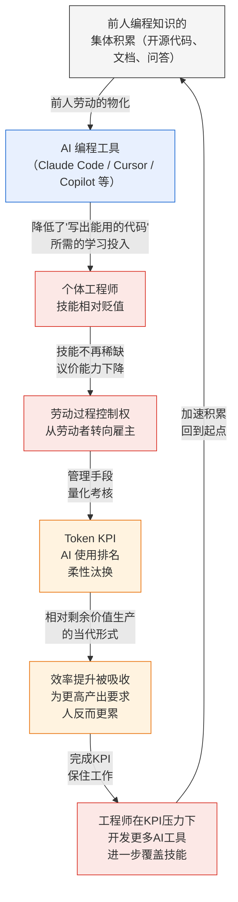

# Phase 1: 理论地图 — AI 编程工具与中国互联网工程师的劳动过程重构

## 1. 语境锚点：2026 年 6 月中国大厂工程师的真实处境

以下事实来自 2026 年 6 月多家媒体的交叉报道，用作建立语境脉络，不作为论文直接引用来源：

### 阿里巴巴（ATH 事业群）
- 2026 年 3 月 16 日成立 Alibaba Token Hub（ATH）事业群，CEO 吴泳铭亲自挂帅，"最高战略优先级"
- 整合通义实验室、MaaS 业务线、千问事业部、悟空事业部、AI 创新事业部，6 月进一步成立 Token Foundry 事业部
- 核心考核指标从日活用户数（DAU）直接换成 Token 消耗量；模型效果、用户体验全部折算为 Token 调用量
- 员工 Token 消耗做成排行榜，排名直接与绩效、转正、晋升挂钩
- 内部设 3-5 人"超级小组"（95 后、00 后为主），不设短期 KPI，但传统工程师受 Token 消耗排名约束

### Token KPI 在全行业的扩散
- 腾讯：内部公布 Token 消耗排名，后于 6 月初取消排名和"焦虑式管理"
- 小米：大模型负责人罗福莉公开表示"每天 AI 对话少于 100 次的人可以辞职"
- 58 同城：董事长姚劲波要求"Token 用得越多越好，不计成本"
- 网易：AI 工具聚合平台积分消耗低的员工被约谈
- 昆仑万维：强制全员使用 AI 编程工具，开发效率须提高至少 50%，未达标 5%-20% 末位淘汰
- 某深圳互联网公司：AI 代码生成率须 ≥80%，每季度统计，不达标影响绩效

### 柔性汰换与岗位消融
- 无一家中国公司公开宣布因 AI 替代而裁员
- 手段：不招新人、不续签合同、业务调整、压缩团队 25%-50%
- 前端岗位几乎消失：得物解散前端部门、阿里取消后端招聘、JD 更名"AI 全栈工程师"
- 2026 年 Q1 海外裁员 4 万+（亚马逊、Meta 等），谷歌 75% 新增代码由 AI 生成，Meta 已无人手写代码

### 效率悖论
- 阿里工程师自述：在做一个"加速淘汰自己的工具"——Coding Agent 做成了加速被替代，做不成被裁时连好绩效都没有
- 字节团队"疯魔了"，每个人怕落后
- 多位程序员描述："AI 效率提升 2 倍，老板预期工作量变 3 倍"
- Token 额度用完后需自费购买，月费 500-1000 元——"只有我在付费上班"

---

## 2. 五环因果链（论文核心叙事）

```
第一环                              第二环
前人编程知识的集体积累            →  当下个体工程师的技能相对贬值
（AI模型凝结了海量代码、          （拥有相同技能不再等于拥有
文档、问答中的智力劳动）              议价能力，劳动力市场价格承压）

        ↓

第三环                              第四环
劳动过程控制权从劳动者            →  效率提升不转化为闲暇，
向资本方倾斜                      转化为更高产出要求
（Token KPI、AI使用排名、          （管理层立刻吸收效率增益
架构调整无需协商）                    为新的产出基线）

        ↓

第五环（闭环）
工程师在 KPI 压力下开发的 AI 工具
→ 进一步覆盖自己和他人的技能
→ 回到第一环，循环加速
```

**核心论点**：AI 编程工具让个体工程师的技能相对贬值，雇主由此获得了更大的劳动过程控制权。控制权在手，AI 的效率提升立即被转化为更高的产出要求——人反而更累了。而工程师在考核压力下亲手开发的内部 AI 工具，正在不断覆盖自己和他人的技能，构成一个自我加速的循环。

---

## 3. 与马克思理论框架的对应

不使用术语堆砌。以下用通顺中文说明马克思的分析逻辑如何解释每一环：

### 第一环：工具不凭空产生——它是前人劳动的凝结

**马克思的分析起点**：任何生产工具都不是天上掉下来的。机器、设备、技术方案——这些都是过去的劳动者用时间和智力创造出来的。在资本主义生产关系下，这些前人劳动的成果被积累和物化为"不变资本"（厂房、机器、技术系统）。AI 编程工具特殊的地方在于：它凝结的不是体力，而是全球程序员几十年写下的代码、文档和问答。这种凝结劳动的规模前所未有。

**对应学术概念**：不变资本 / 前人劳动的物化（Marx,《资本论》第一卷第五章）

### 第二环：技能的市场价值随技术工具的升级而相对下降

**马克思的分析逻辑**：劳动力的价值（工资水平的基础）取决于"劳动力再生产"需要多少社会必要劳动时间。简单说：培养一个能干活的人需要花多长时间、多少资源，决定了这个人的工资底线在哪里。当 AI 工具大幅降低了"写出能用的代码"所需的学习投入，劳动力再生产的成本就下降了——这意味着劳动力市场价格的系统性承压。这不等于"程序员没用了"，但它意味着：拥有编码能力这件事在市场上不再稀缺。

**对应学术概念**：劳动力再生产成本的下降 / 相对过剩人口的形成（Marx,《资本论》第一卷第二十三章）

### 第三环：技能贬值后，劳动者失去了对劳动过程的议价权

**马克思的分析逻辑**：在资本与劳动的关系中，控制权分布取决于双方的议价力量。当劳动者的技能是不可替代的，他就能在"怎么干活"这件事上保留自主权。当技能可以被机器或更廉价的劳动力替代，控制权就向资本方转移。2026 年大厂的 Token KPI、AI 使用排名、架构调整无需协商——这些不是技术问题，而是控制权转移的组织表现。怎么用 AI、用多少、用什么工具——这些决定不再属于工程师自己。

**对应学术概念**：劳动过程从属于资本 / 形式从属到实质从属（Marx,《资本论》第一卷第十一至十三章；Braverman, 1974）

### 第四环：控制权在手，效率提升全归雇主

**马克思的分析逻辑**：机器的引入缩短了生产单位产品所需的时间。在工人控制劳动过程的条件下，这可能意味着更短的工作日。但在资本控制劳动过程的条件下，缩短的只是"社会必要劳动时间"——即再生产劳动力价值所需的时间。超出这个时间的部分（剩余劳动时间）不仅不会缩短，反而被拉长。这就是马克思说的"相对剩余价值生产"：不是延长工作时间，而是在同样时间内榨取更多劳动。Token KPI 正是这个逻辑的当代版本——AI 让你一天能干三天的活，但公司不会让你只干一天，而是期待你现在一天干五天的活。

**对应学术概念**：相对剩余价值生产 / 劳动强度的提升（Marx,《资本论》第一卷第十章、第十五章）

### 第五环：个体理性与系统非理性的矛盾

**马克思的分析逻辑**：在竞争性市场结构中，每个资本和每个劳动者都面临"先活下来"的压力。程序员个人选择积极使用 AI 工具来提高绩效、保住工作——这是完全理性的。但当所有人都这样做时，他们正在把更多技能物化到工具中，加速了整个职业群体的技能贬值。这不是任何人的阴谋——这是结构性的：个体理性选择在系统层面产生了非理性的集体结果。马克思分析市场时反复出现这个主题。

**对应学术概念**：竞争的强制规律 / 资本主义生产的内在矛盾（Marx,《资本论》第一卷、第三卷）

---

## 4. 关键学术文献

### 经典基础
| 文献 | 核心论点 | 本文用法 |
|------|---------|---------|
| Marx, *Capital* Vol. 1, Ch. 13-15 (1867) | 机器和大工业：机器如何分解工人技能，延长剩余劳动时间 | 提供最基础的分析框架，不堆术语，用平实中文重述 |
| Braverman, *Labor and Monopoly Capital* (1974) | "去技能化"是资本主义劳动过程的系统倾向：概念与执行分离 | 关键引用——编程正在经历 Braverman 分析过的同一个过程 |

### 2024-2026 年学术研究
| 文献 | 核心论点 | 本文用法 |
|------|---------|---------|
| Steinhoff (2024), "The universality of the machine", *Work in the Global Economy* | 机器学习是一种新的"吸收"机制——将工人的技能和知识提取到机器中，且不需要传统意义上的知识编码 | 解释为什么 AI 编程工具的去技能化能力超过了历史上的任何技术 |
| Foster (2024), "Braverman, Monopoly Capital, and AI", *Monthly Review* | Braverman 框架对 AI 时代的分析力："集体工人"在 AI 下的重构 | 兜底理论支撑 |
| Zhang (2026), "From human surplus value to AI algorithmic surplus value", *Humanities and Social Sciences Communications* (Nature) | AI 系统仍然是不变资本——不自主创造价值，但通过算法压缩社会必要劳动时间，强化相对剩余价值生产 | 解释 Token KPI 如何成为新的劳动纪律装置 |
| Alenezi (2026.6), "Human-AI Collaboration and the Transformation of Software Engineering Work", arXiv 2606.03394 | 软件工程从"人写代码"变成人指挥、验证、治理 AI——价值从产出量转向意图定义和批判判断 | 解释去技能化后"剩下来的技能"到底是什么 |
| Chauhan (2026), "Automating the automators", *Socio-Economic Review* | 通过对 70 名印度和美国软件工程师的访谈，证明大多数自动化工具在高技能行业也在去技能化劳动者 | 提供跨国比较证据 |
| Xu & Jia (2026), "The Contested Terrain of Skills", *Sociology Compass* | 在中国语境下，技能控制不仅表现为侵蚀已有技能，也表现为系统性阻断新技能的形成 | 解释中国大厂的"柔性汰换"和岗位消融模式 |

### 中文期刊
| 文献 | 核心论点 | 本文用法 |
|------|---------|---------|
| 《学习与实践》2026 年第 5 期，"人工智能时代的劳动价值论重释" | AI 同时强化了相对剩余价值（压缩必要劳动时间）和绝对剩余价值（劳动碎片化延长实际劳动时间） | 双重强化机制——解释了"效率提升但人更累" |
| 《思想理论战线》2026 年第 5 期，"从机器到算法：AI 时代'死劳动'统治'活劳动'的跃升" | 算法代表了"死劳动"统治"活劳动"的智能跃升——算法的"自主创造力"是资本通过知识私有化制造的幻象 | 解释 AI 编程工具为何看起来"会思考"，但本质仍是前人劳动的物化 |
| CASS 杨天宇 (2026)，"资本主义智能化的分配悖论及其替代方案" | AI 的"资本偏向""技能偏向""任务偏向"不是技术本身的性质，而是资本主义生产关系造成的 | 结尾反思：技术方向是可以选择的 |

---

## 5. 概念关系图（Mermaid 架构图）



---

## 6. 本文的定位边界

**本文分析什么**：
- AI 编程工具对中国互联网工程师劳动过程的影响机制
- 通过 2026 年 Token KPI 考核体系的案例，实证分析"技能贬值 → 控制权转移 → 劳动强度上升"的因果链
- 用马克思分析机器大工业的框架来解释当前现象

**本文不分析什么**：
- AI 是否会导致程序员"大面积失业"（就业总量问题）
- AI 芯片、底层编译器、训练框架等基础设施层（超出劳动过程分析的范畴）
- 开源 vs 闭源的技术路线争论
- 美国或全球的就业市场（仅以国际案例做比较参照）

**本文的学科定位**：
- 马克思主义政治经济学视角下的技术劳动过程分析
- 以经验素材（大厂考核体系）为案例的概念性论文
- 不是纯理论推导，也不是纯经验报告——是理论与经验的对话

---

## Gate 1 自检

| 检查项 | 状态 |
|--------|------|
| 深度报道已找到 | ✅ 36氪多篇报道（2026.6）、阿里ATH专题分析 |
| 语境提取完整 | ✅ 阿里/腾讯/小米/58/网易/昆仑万维等多公司具体考核机制 |
| 概念联想有报道细节支撑 | ✅ Token排行榜、DAU换Token、"日对话少于100次辞职"等 |
| 学术文献验证通过 | ✅ Steinhoff 2024、Foster 2024、Zhang 2026、Chauhan 2026 等 |
| 理论地图生成 | ✅ 本文档 |
